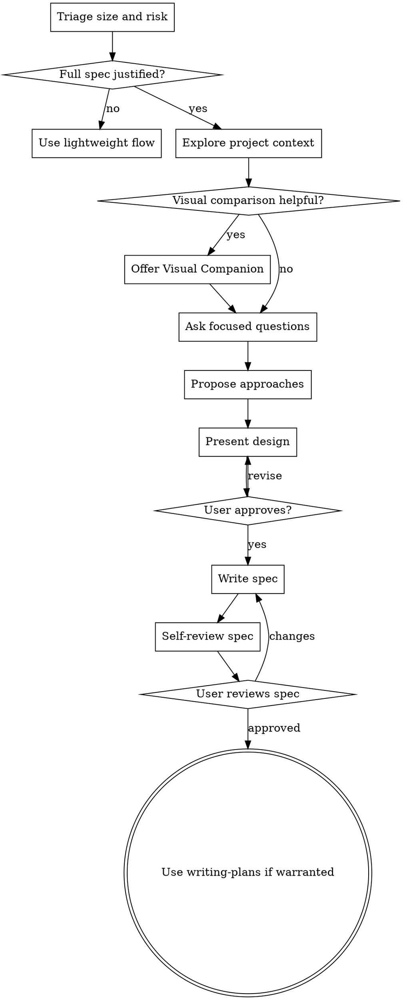

# Brainstorming Ideas Into Designs

Use brainstorming to turn unclear or high-risk ideas into a design the user can
approve. Scale the process to the task.

## Triage

| Request | Brainstorming shape |
|---------|---------------------|
| Tiny edit or obvious bugfix | Use direct implementation; a design doc adds no value |
| Small clear feature | Ask at most one clarifying question, then use a short checklist |
| Medium unclear feature | Use a lightweight design note and approval |
| Large/high-risk work | Use the full spec flow below |

Risk signals that justify the full flow:
- authentication, authorization, billing, data migration, or data loss
- public APIs or cross-module architecture
- vague user intent or multiple plausible approaches
- work spanning independent subsystems
- visual/product decisions that benefit from comparison

## Lightweight Flow

For medium work where a full spec would be too much:

1. Check relevant project context.
2. Ask one clarifying question if needed.
3. Present the recommended approach plus one alternative.
4. Get user approval.
5. Write a short design note only when it will help execution or future sessions.
6. Move to a short plan or direct implementation based on size.

## Full Spec Flow

Use this for large or high-risk work:

1. **Explore project context** — check files, docs, recent commits.
2. **Offer visual companion** when upcoming choices are genuinely visual.
3. **Ask clarifying questions** one at a time.
4. **Propose 2-3 approaches** with tradeoffs and a recommendation.
5. **Present design** in sections scaled to complexity.
6. **Write design doc** to `docs/superpowers/specs/YYYY-MM-DD-<topic>-design.md` unless user preferences say otherwise.
7. **Spec self-review** for placeholders, contradictions, ambiguity, and scope.
8. **User review** of the written spec.
9. **Transition to implementation** with `superpowers:writing-plans` when a plan file is warranted.

## Process Flow

## Design Guidance

**Understanding the idea:**
- Check current project structure before proposing changes.
- If the request spans independent subsystems, decompose it early.
- Ask one question at a time.
- Prefer multiple choice when it makes answering easier.
- Focus on purpose, constraints, success criteria, and risk.

**Exploring approaches:**
- Present 2-3 approaches only when real alternatives exist.
- Lead with the recommended option and explain why.
- Keep tradeoffs concrete: complexity, risk, user experience, reversibility.

**Presenting the design:**
- Scale each section to complexity.
- Cover architecture, components, data flow, error handling, and testing when relevant.
- Ask for approval at natural checkpoints.

**Working in existing codebases:**
- Follow established patterns.
- Include targeted cleanup when it directly serves the requested work.
- Keep unrelated refactors out of the design.

## Spec Self-Review

After writing a spec, run this inline:

1. **Placeholder scan:** Replace "TBD", "TODO", and vague requirements.
2. **Internal consistency:** Align architecture, feature behavior, and testing.
3. **Scope check:** Split oversized specs into smaller projects.
4. **Ambiguity check:** Choose a concrete interpretation or ask the user.

## Implementation Handoff

After approval:
- Use direct implementation for small approved work.
- Use `superpowers:writing-plans` for medium or larger multi-step work.
- Suggest inline execution for small/tightly coupled work and subagents only where isolation or review helps.

## Visual Companion

A browser-based companion can show mockups, diagrams, and visual options during
brainstorming. Treat it as an optional tool for visual questions.

**Offering the companion:** When upcoming choices would be easier to judge
visually, ask once:

> "Some of what we're working on might be easier to explain if I can show it to you in a web browser. I can put together mockups, diagrams, comparisons, and other visuals as we go. This feature is still new and can be token-intensive. Want to try it? (Requires opening a local URL)"

Use the browser for mockups, wireframes, layout comparisons, architecture
diagrams, and side-by-side visual designs. Use the terminal for requirements,
scope, conceptual choices, and tradeoff lists.

If the user accepts, read the detailed guide:
`skills/brainstorming/visual-companion.md`
