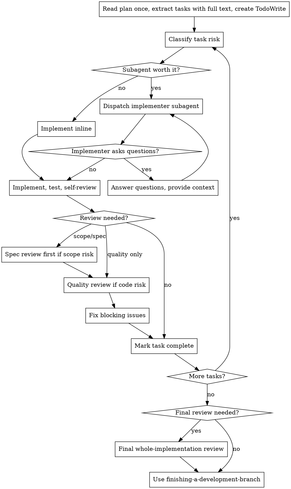

# Subagent-Driven Development

Execute implementation plans with subagents when isolated task execution is worth
the extra cost. Use adaptive review: spec compliance before code quality when
both are needed, with reviewers reserved for tasks where they reduce real risk.

**Why subagents:** You delegate tasks to specialized agents with isolated
context. By crafting their instructions and context, you keep them focused while
preserving your own context for coordination.

**Core principle:** Use subagents and reviewers where they reduce risk more than
they add coordination and token cost.

## Budget Gate

Before dispatching any subagent, estimate the workflow weight:

- number of tasks
- expected subagents if every task gets implementer + reviewers
- whether tasks are mechanical, low-risk, medium-risk, or high-risk
- whether the user chose subagents or a project preference requires them

If the default plan would create more than 5 subagents, or if tasks are mostly
mechanical, tell the user and offer a lighter mode:

> "This plan has N tasks. Full subagent-driven execution could create roughly X
> agent calls. I can run adaptive mode instead: inline/mechanical tasks directly,
> subagents for complex tasks, and reviews only where risk justifies them."

Proceed directly only when the user explicitly requested subagent-driven
execution or project instructions already set that default.

## When to Use

Use this skill when:
- there is a written implementation plan
- tasks are mostly independent
- fresh context will help implementation quality
- the user or project preference chooses subagent execution

Prefer `superpowers:executing-plans` or inline execution when work is small,
tightly coupled, or mostly mechanical.

## The Process



## Review Policy

Classify each task before execution:

| Task risk | Execution | Review |
|-----------|-----------|--------|
| Mechanical literal change | Inline or one cheap implementer | Verification only |
| Low-risk isolated change | Inline or one implementer | Self-review + tests |
| Medium-risk multi-file change | Implementer subagent helpful | Spec or quality review if risk is real |
| High-risk/security/data migration/public API | Subagent recommended | Spec review first, then quality/security review |

Spec compliance review always comes before code quality review when both are
used. Run quality review after scope/spec issues are resolved.

Treat review findings by severity:
- Critical or Important: fix, then re-review the focused issue.
- Minor: fix inline if cheap, otherwise note it as non-blocking.
- Opinion/style with no correctness impact: use judgment and local conventions.

Cap review loops. If a task needs more than one re-review cycle, reassess: the
plan may need correction, the task may need splitting, or the work may need a
more capable model.

## Model Selection

Use the least powerful model that can handle each role.

**Mechanical implementation tasks** (isolated functions, exact specs, 1-2 files):
use a fast, cheap model or inline execution.

**Integration and judgment tasks** (multi-file coordination, pattern matching,
debugging): use a standard model.

**Architecture, design, and high-risk review tasks:** use the most capable
available model.

## Handling Implementer Status

Implementer subagents report one of four statuses. Handle each appropriately:

**DONE:** Run the planned verification, then decide whether review is warranted.

**DONE_WITH_CONCERNS:** Read the concerns before proceeding. If the concerns are
about correctness or scope, address them before review. If they are observations,
note them and continue.

**NEEDS_CONTEXT:** Provide the missing context and re-dispatch.

**BLOCKED:** Assess the blocker:
1. If it is a context problem, provide more context and re-dispatch.
2. If the task requires more reasoning, re-dispatch with a more capable model.
3. If the task is too large, break it into smaller pieces.
4. If the plan itself is wrong, escalate to the user.

Respond to escalations by changing something: context, task size, model, or plan.

## Prompt Templates

- `./implementer-prompt.md` - Dispatch implementer subagent.
- `./spec-reviewer-prompt.md` - Dispatch when scope/spec risk warrants independent review.
- `./code-quality-reviewer-prompt.md` - Dispatch when code quality risk warrants independent review.

## Example Workflow

```
You: I'm using Subagent-Driven Development in adaptive mode.

[Read plan file once: docs/superpowers/plans/feature-plan.md]
[Extract tasks with full text and context]
[Create TodoWrite with all tasks]

Task 1: Hook installation script
[Classify: medium risk because it changes installation behavior]
[Dispatch implementation subagent with full task text + context]

Implementer:
  - Implemented install-hook command
  - Added tests, 5/5 passing
  - Self-review: Found I missed --force flag, added it
  - Committed

[Dispatch spec compliance reviewer because install behavior must match spec]
Spec reviewer: compliant

[Dispatch code quality reviewer because the task touched install flow]
Code reviewer: approved

Task 2: Exact README snippet
[Classify: mechanical doc change]
[Apply inline]
[Verify diff matches requested text]
[Review skipped because verification is sufficient]

Task 3: Recovery modes
[Classify: high risk because it changes repair behavior]
[Dispatch implementation subagent]
[Run spec review first, then quality review]
[Fix blocking issues and re-check only the focused issue]

[After all tasks]
[Dispatch final whole-implementation review if the change is large or cross-cutting]
[Use superpowers:finishing-a-development-branch]
```

## Advantages

**vs. manual execution:**
- Fresh context for tasks that benefit from it.
- Subagents can ask questions before or during implementation.
- Risky tasks get independent review.

**vs. full per-task review:**
- Mechanical work stays mechanical instead of spiraling into many agent calls.
- Review cost is spent where it can catch real defects.
- The controller keeps context lean by extracting task text once.

**Quality gates:**
- Self-review before handoff.
- Verification for every completed task.
- Spec compliance review for scope risk.
- Code quality review for implementation risk.
- Final whole-implementation review for large or cross-cutting work.

## Red Flags

Hard requirements:
- Get explicit user consent before starting implementation on main/master.
- Resolve Critical or Important issues before proceeding.
- Dispatch implementation subagents in parallel only when their files and responsibilities are independent.
- Provide relevant task text directly in the subagent prompt.
- Include scene-setting context in every subagent prompt.
- Answer subagent questions before implementation continues.
- Treat Minor review comments as non-blocking unless they indicate real risk.
- Use independent review for high-risk work.
- Run code quality review after spec compliance passes when both are needed.
- Move to the next task after blocking review issues are resolved.

If a reviewer finds issues:
- Critical/Important: implementer fixes them, then reviewer re-checks the focused issue.
- Minor: fix inline if cheap or record for later.
- Use focused re-checks for blocking issues and lightweight notes for non-blocking issues.

If a subagent fails a task:
- Dispatch a fix subagent with specific instructions, or handle inline if cheaper.
- Include the exact error/failure.
- Continue the current task until it works or is explicitly deferred.

## Integration

Workflow skills:
- **superpowers:using-git-worktrees** - Optional/ask first unless user or project config requires it.
- **superpowers:writing-plans** - Creates the plan this skill executes.
- **superpowers:requesting-code-review** - Code review template for reviewer subagents when review is warranted.
- **superpowers:finishing-a-development-branch** - Complete development after all tasks.

Subagents should use:
- **superpowers:test-driven-development** - Use TDD when the task or project requires it.

Alternative workflow:
- **superpowers:executing-plans** - Use for sequential inline execution.
