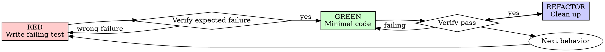

# Test-Driven Development

Write the test first. Watch it fail for the expected reason. Write the smallest
production change that makes it pass. Refactor while keeping it green.

**Core principle:** A test that never failed has not proven it can catch the bug
or missing behavior.

## When To Use

Use TDD for:
- new behavior
- bug fixes
- refactors with observable behavior
- risky code paths where regression matters

Use a lighter verification-only path for:
- text-only documentation edits
- literal config or fixture updates
- throwaway prototypes approved by the user
- generated code where the generator is the tested unit

## Red-Green-Refactor



## The Cycle

### 1. RED: Write One Failing Test

Write one focused test for the next behavior. Name it after the behavior.

Good tests:
- exercise real code
- assert observable behavior
- cover one behavior at a time
- make the desired API obvious

Example:

```typescript
test('retries failed operations three times', async () => {
  let attempts = 0;
  const operation = async () => {
    attempts++;
    if (attempts < 3) throw new Error('fail');
    return 'success';
  };

  await expect(retryOperation(operation)).resolves.toBe('success');
  expect(attempts).toBe(3);
});
```

Run the targeted test. Confirm:
- it fails
- the failure is expected
- the failure proves the behavior is missing

If the test passes immediately, change the test so it captures missing behavior.
If it errors for setup or syntax reasons, fix the test and run it again.

### 2. GREEN: Write Minimal Production Code

Add the smallest production change that makes the failing test pass. Keep the
scope tight:
- satisfy the current test
- preserve existing behavior
- defer extra options and abstractions until a test needs them

Run the targeted test and any nearby regression tests.

### 3. REFACTOR: Clean Up Safely

After tests pass:
- improve names
- remove duplication
- extract helpers
- simplify structure

Run the tests again after refactoring.

## Bug Fixes

For a bug:
1. Write a failing test that reproduces the bug.
2. Confirm it fails for the observed symptom.
3. Fix the code.
4. Confirm the regression test passes.
5. Run relevant surrounding tests.

## When Existing Code Already Exists

If implementation code was written before the test, treat it as exploration:
- read it to understand the idea if useful
- write the behavior test from requirements
- implement the final fix from the test
- remove exploratory code that the test does not justify

## Test Quality

Prefer tests that use real code. Use mocks only to isolate slow, external, or
unreliable boundaries. When adding mocks, test utilities, or test-only hooks,
read `testing-anti-patterns.md`.

Quality checks:
- The test name describes behavior.
- The assertion would fail if the behavior regressed.
- The test covers an edge case or error path when relevant.
- The test avoids asserting on mock internals.

## Completion Checklist

Before claiming the change is done:
- A behavior test exists for each new behavior or bug fix.
- Each new test was observed failing for the expected reason.
- Production code was added after the failing test.
- Targeted tests pass.
- Relevant broader tests pass or the reason for skipping them is stated.
- Test output is clean enough to trust.

## Common Pressure Points

| Pressure | Better move |
|----------|-------------|
| "This is too simple" | Add the tiny test or use verification-only for non-behavior edits |
| "I'll test after" | Write the expected behavior first |
| "I need to explore" | Explore briefly, then test-drive the final code |
| "The test is hard" | Simplify the interface or split the behavior |
| "Mocks make this easy" | Check `testing-anti-patterns.md` and mock the smallest reliable boundary |

## Final Rule

Production behavior should be backed by a test that failed before the behavior
was implemented.
