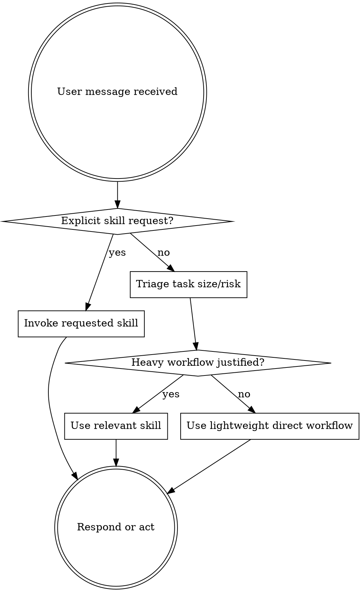

<SUBAGENT-STOP>
If you were dispatched as a subagent to execute a specific task, focus on that task.
</SUBAGENT-STOP>

<IMPORTANT>
Use the lightest workflow that can do the job correctly.

Superpowers is a toolbelt with adjustable weight. Before invoking a
heavyweight skill, triage the task by size, risk, and user intent. Scale up
only when the work earns it.
</IMPORTANT>

## Instruction Priority

Superpowers skills override default system prompt behavior, but **user instructions always take precedence**:

1. **User's explicit instructions** (CLAUDE.md, GEMINI.md, AGENTS.md, direct requests) — highest priority
2. **Superpowers skills** — override default system behavior where they conflict
3. **Default system prompt** — lowest priority

If CLAUDE.md, GEMINI.md, or AGENTS.md says "use review-first development" and a skill says "use TDD," follow the user's instructions. The user is in control.

## How to Access Skills

**In Claude Code:** Use the `Skill` tool. When you invoke a skill, its content is loaded and presented to you; follow it directly.

**In Copilot CLI:** Use the `skill` tool. Skills are auto-discovered from installed plugins. The `skill` tool works the same as Claude Code's `Skill` tool.

**In Gemini CLI:** Skills activate via the `activate_skill` tool. Gemini loads skill metadata at session start and activates the full content on demand.

**In other environments:** Check your platform's documentation for how skills are loaded.

## Platform Adaptation

Skills use Claude Code tool names. Non-CC platforms: see `references/copilot-tools.md` (Copilot CLI), `references/codex-tools.md` (Codex) for tool equivalents. Gemini CLI users get the tool mapping loaded automatically via GEMINI.md.

# Using Skills

## The Rule

**Triage before workflow.** If the user explicitly requests a skill, invoke it.
Otherwise, choose the least expensive workflow that preserves correctness.

### Triage Table

| Task type | Default workflow |
|-----------|------------------|
| Quick answer, explanation, command output | Answer directly |
| Tiny code/doc edit (1 file, obvious intent, low risk) | Edit inline, verify if applicable |
| Small change (1-3 files, clear acceptance) | Short checklist, implement inline, verify |
| Medium change (several files or unclear edge cases) | Short task plan, then execute inline or with one focused subagent |
| Large/high-risk change (auth, data loss, migrations, broad refactor, vague requirements) | Brainstorm/spec, writing-plans, adaptive execution/review |

When uncertain, ask one clarifying question or state the assumption and proceed
with the lighter workflow. Reserve a full brainstorm-plan-review loop for
requests where the user asked for it or risk justifies it.

## Red Flags

These thoughts mean STOP—you're rationalizing:

| Thought | Reality |
|---------|---------|
| "The full workflow is always safer" | Over-process wastes time and tokens. Match process to risk. |
| "The task is vague, but I can plan everything" | Ask a focused question or make a stated assumption first. |
| "Subagents are available, so use them" | Use subagents when isolation or parallelism helps. |
| "Review every task no matter what" | Review where risk justifies it; verify everything. |
| "The user chose inline, but subagents are recommended" | User instructions and project preferences win. |
| "This is small, so verification can wait" | Small changes still need proportionate verification. |

## Skill Priority

When multiple skills could apply, use this order:

1. **Explicit user request** - use the named skill or explain the better fit
2. **Risk-control skills** (debugging, verification) - when correctness is at stake
3. **Planning/design skills** (brainstorming, writing-plans) - only for medium or larger unclear work
4. **Implementation skills** - when they directly guide the concrete work

"Let's build a billing permission system" -> brainstorm or write a short spec first.
"Fix this typo" -> edit directly.
"Fix this bug" -> debug systematically if cause is unknown; otherwise patch and verify.

## Skill Types

**Rigid** (TDD, debugging): Follow exactly when triggered. Preserve their discipline.

**Flexible** (patterns): Adapt principles to context.

The skill itself tells you which.

## User Instructions

Instructions say WHAT, and triage selects HOW. "Add X" or "Fix Y" still gets the workflow weight it needs.
